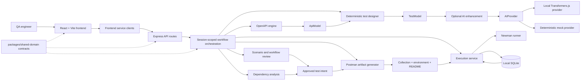
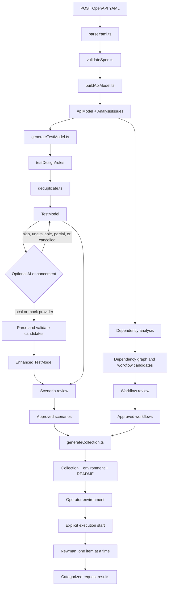

<p align="center">
  
</p>

<h1 align="center">ApiPilot</h1>

[](https://www.typescriptlang.org/)
[](https://nodejs.org/)
[](https://www.openapis.org/)
[](https://vitest.dev/)
[](https://eslint.org/)
[](LICENSE)
[](https://github.com/io-anurag/ApiPilot/actions/workflows/ci.yml)
[](https://github.com/io-anurag/ApiPilot/releases/)

ApiPilot is a local-first API test engineering workspace. It turns one OpenAPI 3.x YAML document into a structured API model, deterministic test scenarios, optional locally generated semantic suggestions, reviewed dependency workflows, and validated Postman artifacts. Approved artifacts can be executed explicitly against an environment chosen by the operator and reported as request-level results.

The product is deliberately deterministic before it is intelligent:

```text
OpenAPI YAML
    -> ApiModel
    -> deterministic TestModel
    -> optional AI enhancement
    -> human scenario review
    -> dependency and workflow review
    -> Postman collection, environment, and README
    -> explicit Newman execution
    -> execution results
```

AI is bounded, validated, and local. It can suggest scenarios and relationships, but it cannot add undocumented endpoints, methods, fields, authentication schemes, response codes, or assertions to the executable model.

## Contents

- [Current capabilities](#current-capabilities)
- [Architecture](#architecture)
- [Processing pipeline](#processing-pipeline)
- [Quick start](#quick-start)
- [Configuration](#configuration)
- [HTTP API](#http-api)
- [Persistence, sessions, and security](#persistence-sessions-and-security)
- [Repository structure](#repository-structure)
- [Development and validation](#development-and-validation)
- [Limitations and roadmap](#limitations-and-roadmap)
- [Documentation](#documentation)
- [License](#license)

## Current capabilities

The following capabilities are implemented in the current repository:

- OpenAPI 3.x YAML upload, validation, normalization, internal `$ref` resolution, and API-model construction.
- Deterministic positive, required-field, null/empty, invalid-type, invalid-format, invalid-enum, numeric-boundary, string-boundary, and array-boundary scenarios.
- Specification-grounded response and schema assertions with deterministic per-operation deduplication and provenance.
- Optional AI scenario enhancement through a provider abstraction, with local Transformers.js inference or a deterministic mock provider.
- AI readiness reporting, FIFO serial inference, bounded batching, viability checks, cancellation, incremental progress, and one retry for a malformed batch response.
- Scenario review with accept, reject, edit, regenerate, bulk decisions, validation, rationale, and stale-state handling.
- Deterministic and optional AI-assisted API dependency analysis with evidence, confidence classes, graph construction, and ordered workflow candidates.
- Workflow review and workflow-aware Postman rendering.
- Postman collection, environment, and artifact README generation from approved test intent.
- OpenAPI parameter serialization for supported `style` and `explode` combinations, credential variables per distinct security scheme, automatic producer-to-consumer chaining, and OAuth2 client-credentials token setup.
- Explicit Newman execution, one request at a time, with cancellation, safety confirmation, request delays, and categorized pass/fail/not-attempted outcomes.
- Per-browser session isolation using an unguessable HTTP-only cookie and a 60-minute idle eviction policy.
- Local SQLite persistence for environments, encrypted credential-like values, execution history, and AI readiness/benchmark diagnostics.
- React/Vite frontend with accessible review controls, progress reporting, filtering, bulk actions, loading/error/empty states, and frontend error forwarding to the backend logger.

## Architecture

ApiPilot is an npm-workspaces monorepo. The frontend and HTTP routes are adapters around framework-independent domain modules and shared TypeScript contracts.



### Component boundaries

| Component                             | Responsibility                                                                                                         |
| ------------------------------------- | ---------------------------------------------------------------------------------------------------------------------- |
| `frontend/`                           | React/Vite workflow UI, presentation, interaction, and service clients.                                                |
| `backend/src/api/`                    | Thin HTTP adapters, request validation, response mapping, and error status mapping.                                    |
| `backend/src/openapi/`                | YAML parsing, OpenAPI validation, internal reference resolution, normalization, analysis, and `ApiModel` construction. |
| `backend/src/testDesign/`             | Deterministic rules, generated values, assertions, deduplication, AI candidate validation, and review transformations. |
| `backend/src/dependencies/`           | Relationship evidence, deterministic matching, AI-assisted corroboration, graph construction, and workflow assembly.   |
| `backend/src/ai/`                     | `AIProvider`, local/mock providers, readiness, queueing, batching, viability, model configuration, and benchmarks.     |
| `backend/src/postman/`                | Collection, environment, workflow, authentication, parameter, assertion, and artifact-document rendering.              |
| `backend/src/testGenerationWorkflow/` | In-memory stage state machine, gating, invalidation, progress, and review orchestration.                               |
| `backend/src/execution/`              | Environment handling, run lifecycle, sequencing, cancellation, and Newman integration.                                 |
| `backend/src/persistence/`            | SQLite connection, repositories, schema initialization, interrupted-run recovery, and credential encryption.           |
| `packages/shared-domain/`             | Framework-independent contracts for API models, tests, AI, review, dependencies, workflows, artifacts, and execution.  |

The shared-domain package contains no Express, React, browser, or Node-specific implementation. Postman is an output target, not the internal test model.

## Processing pipeline



### 1. OpenAPI to `ApiModel`

`POST /api/specifications` accepts one multipart YAML file under the `file` field. `parseYaml.ts`, `validateSpec.ts`, and `buildApiModel.ts` extract operations, parameters, request bodies, responses, schemas, security requirements, constraints, and examples. Internal same-document references may be resolved. External references are not fetched, uploaded content is not executed, and unsupported or unresolved constructs remain errors or visible analysis issues.

### 2. Deterministic test design

`generateTestModel.ts` applies pure rule modules to every operation. Positive values respect the specification. Negative values target a particular documented constraint. Assertions use only documented response codes and schemas; ApiPilot does not invent a generic `400`, `401`, `404`, or `500` expectation. Equivalent request/assertion pairs are deduplicated per operation while retaining rule provenance.

### 3. AI enhancement

`enhanceTestModel.ts` sends bounded requests through `AIProvider`. `localProvider.ts` is the only module coupled to Transformers.js; routine tests use `mockProvider.ts`. Responses are structurally parsed and semantically validated against the complete `ApiModel`, then merged deterministically. AI results retain confidence, rationale, assumptions, provider/model identity, and provenance. A failed or unavailable AI pass leaves the deterministic baseline usable.

Scenario enhancement uses deterministic operation batches, normally one operation per unit. Dependency analysis normally uses three operations per unit. Run budgets, request timeouts, pre-flight viability checks, progress, cancellation, and partial outcomes prevent large specifications from becoming unbounded local inference jobs.

### 4. Review and dependency workflows

Review decisions are explicit: pending, accepted, or rejected. Edits and regeneration are revalidated. Changes to upstream decisions mark downstream stages stale and block export until regeneration. Dependency analysis classifies relationships as `CONFIRMED`, `LIKELY`, or `POSSIBLE` using evidence; possible relationships remain review candidates. Approved workflows are ordered with stable tie-breaks and named producer/consumer hand-off variables.

### 5. Postman generation

`generateCollection.ts` exports only approved scenarios. It preserves approved negative values and assertions, validates the generated collection, and emits an environment and human-readable artifact README. Unknown values and credentials are variables rather than guesses. Supported authentication and export features include distinct variables for distinct security schemes, automatic response-value chaining, OAuth2 client-credentials token setup, workflow folders, and OpenAPI-conformant parameter serialization. Unsupported styles or content are reported as limitations rather than silently guessed.

### 6. Execution

Execution reuses the same generated collection logic used for export. The operator defines an environment with a base URL and variable/credential values, then explicitly starts a run. The backend uses Newman to execute each approved request serially, carries forward environment variables produced by prior workflow steps, and applies a 30-second per-request timeout. Results distinguish assertion failure, unexpected status, connectivity failure, timeout, assertion-evaluation failure, cancellation, and not-attempted requests. Staging/production environments and destructive operations require confirmation.

## Quick start

### Requirements

- Node.js 20 LTS or newer, as specified by `.nvmrc` and the root `engines` field.
- npm.
- For local AI: disk space for the selected model, free memory for inference, and network access only for the initial model download. No GPU is required.
- For deterministic-only use and routine tests: set `AI_PROVIDER_MODE=mock`; no model download is needed.

### Run the application

```powershell
npm install
Copy-Item .env.example .env
npm run dev
```

The Vite frontend is available at `http://localhost:5173` and proxies `/api` requests to the backend at `http://localhost:4000`. `npm run dev` runs the backend and frontend concurrently and first invokes `scripts/dev-stop.mjs` to stop stale local processes. Use `npm run stop` to stop development servers.

The `.env` file is optional when defaults are acceptable. The default development mode is local AI outside tests; set `AI_PROVIDER_MODE=mock` for a fast, model-free run.

### Use the workflow

1. Upload an OpenAPI 3.x YAML document.
2. Review the extracted API operations and analysis issues.
3. Generate deterministic scenarios.
4. Optionally run local AI enhancement and review its suggestions.
5. Accept, reject, edit, or regenerate scenarios.
6. Review detected API dependencies and workflows.
7. Approve workflows and generate the Postman artifacts.
8. Define an authorized target environment.
9. Explicitly start execution and inspect the results.

## Configuration

Copy `.env.example` to `.env` to override defaults. Configuration is loaded by `backend/src/loadEnv.ts`; backend startup validates the enhancement run budget and initializes persistence before accepting requests.

| Variable                             | Purpose                                                             | Default                                 |
| ------------------------------------ | ------------------------------------------------------------------- | --------------------------------------- |
| `BACKEND_PORT`                       | Express listener port                                               | `4000`                                  |
| `FRONTEND_DEV_PORT`                  | Vite development server port                                        | `5173`                                  |
| `GIT_COMMIT`                         | Commit value returned by `/api/version`                             | Detected from Git, otherwise `unknown`  |
| `DEBUG_LOG_REAL_CLIENT_IP`           | Opt in to using the Vite proxy's forwarded client IP in diagnostics | `false`                                 |
| `AI_PROVIDER_MODE`                   | `local` or deterministic `mock`                                     | `mock` in tests, `local` otherwise      |
| `AI_MODEL_ID`                        | Hugging Face Transformers.js model identifier                       | `onnx-community/Qwen2.5-0.5B-Instruct`  |
| `AI_MODEL_CACHE_DIR`                 | Local model cache directory                                         | `~/.apipilot/models`                    |
| `AI_MODEL_DTYPE`                     | Optional ONNX precision/quantization                                | Unset; fp32 is the measured CPU default |
| `AI_INFERENCE_TIMEOUT_MS`            | Per-request local inference timeout                                 | `120000`                                |
| `AI_MODEL_CONTEXT_FLOOR_TOKENS`      | Conservative context estimate when a model reports none             | `2048`                                  |
| `AI_USE_ACCELERATOR`                 | Attempt hardware acceleration                                       | `false`                                 |
| `AI_ENHANCEMENT_OPERATIONS_PER_UNIT` | Operations per scenario-enhancement batch                           | `1`                                     |
| `AI_ENHANCEMENT_RUN_BUDGET_MS`       | Whole enhancement run wall-clock ceiling                            | `2700000`                               |
| `AI_DEPENDENCY_OPERATIONS_PER_UNIT`  | Operations per AI dependency batch                                  | `3`                                     |
| `AI_DEPENDENCY_RUN_BUDGET_MS`        | Whole AI dependency pass ceiling                                    | `120000`                                |
| `AI_PREFILL_MS_PER_TOKEN`            | Optional viability estimate override                                | Code default                            |
| `AI_DECODE_MS_PER_TOKEN`             | Optional viability estimate override                                | Code default                            |
| `AI_VIABILITY_SAFETY_FACTOR`         | Optional viability margin override                                  | Code default                            |
| `APIPILOT_DB_PATH`                   | SQLite database path                                                | `~/.apipilot/apipilot.db`               |

On Windows, an enabled accelerator requests DirectML; Linux uses CUDA where available and macOS uses CoreML where available. Check `/api/ai/status` because requesting an accelerator does not guarantee that it initialized. The default local model is roughly 1.7 GB on disk and measured at about 2.75 GB peak process RSS on the reference CPU profile; actual requirements depend on the selected model and dtype.

## HTTP API

The backend mounts all routes under `/api`. The browser receives an HTTP-only `sessionId` cookie; workflow endpoints operate on that session and do not take a workflow ID.

### Health and metadata

| Method | Endpoint           | Purpose                                                                                       |
| ------ | ------------------ | --------------------------------------------------------------------------------------------- |
| `GET`  | `/api/health`      | Returns `{ status: "ok", timestamp }`.                                                        |
| `GET`  | `/api/version`     | Returns the application version and commit identifier.                                        |
| `GET`  | `/api/ai/status`   | Returns provider readiness, model/accelerator information, and persisted diagnostics.         |
| `POST` | `/api/client-logs` | Accepts size-limited frontend warning/error logs after credential-shaped fields are filtered. |

### Stateless/domain endpoints

| Method | Endpoint                              | Input/output                                                             |
| ------ | ------------------------------------- | ------------------------------------------------------------------------ |
| `POST` | `/api/specifications`                 | Multipart `file`; returns `{ apiModel }`.                                |
| `POST` | `/api/test-models`                    | JSON `apiModel`; returns a deterministic `{ testModel }`.                |
| `POST` | `/api/test-models/enhance`            | JSON model/enhancement request; returns AI-enhanced model/progress data. |
| `POST` | `/api/test-models/reviews`            | Applies scenario review updates.                                         |
| `POST` | `/api/test-models/reviews/edit`       | Validates and applies a scenario edit.                                   |
| `POST` | `/api/test-models/reviews/regenerate` | Regenerates a review scenario through the configured provider.           |
| `POST` | `/api/api-models/dependencies`        | Analyzes API relationships and assembles workflow candidates.            |
| `POST` | `/api/test-models/postman-collection` | Generates and validates collection artifacts from approved intent.       |

### Guided workflow endpoints

| Method         | Endpoint                                                    | Purpose                                                                                                 |
| -------------- | ----------------------------------------------------------- | ------------------------------------------------------------------------------------------------------- |
| `GET` / `POST` | `/api/test-generation-workflow`                             | Read the current session workflow, poll progress with `?progressOnly=true`, or upload/start a workflow. |
| `POST`         | `/api/test-generation-workflow/api-review/continue`         | Complete API review.                                                                                    |
| `POST`         | `/api/test-generation-workflow/deterministic-generation`    | Run deterministic scenario generation.                                                                  |
| `POST`         | `/api/test-generation-workflow/ai-enhancement`              | Start optional AI enhancement.                                                                          |
| `POST`         | `/api/test-generation-workflow/ai-enhancement/cancel`       | Request cancellation at a batch boundary.                                                               |
| `POST`         | `/api/test-generation-workflow/ai-enhancement/retry-batch`  | Retry one failed batch using `{ batchIndex }`.                                                          |
| `POST`         | `/api/test-generation-workflow/scenario-review/decisions`   | Apply scenario decisions using an `updates` array.                                                      |
| `POST`         | `/api/test-generation-workflow/scenario-review/edit`        | Edit a scenario using `scenarioId`, `revision`, and `edit`.                                             |
| `POST`         | `/api/test-generation-workflow/scenario-review/regenerate`  | Regenerate one scenario.                                                                                |
| `POST`         | `/api/test-generation-workflow/scenario-review/finalize`    | Finalize scenario review.                                                                               |
| `POST`         | `/api/test-generation-workflow/workflow-review/decisions`   | Apply workflow approval/rejection decisions.                                                            |
| `POST`         | `/api/test-generation-workflow/workflow-review/continue`    | Complete workflow review.                                                                               |
| `POST`         | `/api/test-generation-workflow/postman-generation`          | Generate approved Postman artifacts; accepts export options.                                            |
| `GET` / `POST` | `/api/test-generation-workflow/environments`                | List or create session environments.                                                                    |
| `PUT`          | `/api/test-generation-workflow/environments/:environmentId` | Update an environment.                                                                                  |
| `POST`         | `/api/test-generation-workflow/execution/start`             | Start an asynchronous run using `{ environmentId, confirmed? }`.                                        |
| `POST`         | `/api/test-generation-workflow/execution/cancel`            | Request cancellation of the active run.                                                                 |
| `GET`          | `/api/test-generation-workflow/execution/runs`              | List session run summaries.                                                                             |
| `GET`          | `/api/test-generation-workflow/execution/runs/:runId`       | Retrieve one run and its request results.                                                               |

Common contract failures use JSON such as `{ error, message }`. Invalid uploads return `400`; oversized uploads return `413`; stage conflicts, confirmation requirements, duplicate resources, and active-run conflicts return `409`; missing resources return `404`; unexpected failures return a safe `500` without stack traces or raw internal details.

The authoritative request and response shapes are the TypeScript contracts in `packages/shared-domain/src/` and the feature contracts under `specs/*/contracts/`.

## Persistence, sessions, and security

### Session model

There is no login or account system. Each browser receives an unguessable UUID in an HTTP-only, same-site cookie. `AsyncLocalStorage` scopes the current workflow to that session, so concurrent browsers do not share workflow state. Sessions are evicted after 60 minutes of inactivity. Guided workflow state is in memory and is lost on backend restart; a reload or second tab in the same active browser session resumes it.

### SQLite persistence

`better-sqlite3` creates the configured database and schema on first use. The persisted categories are:

- Session-owned environments and their execution run history.
- AI readiness history and benchmark diagnostics, which are process-wide rather than session-owned.

Environment variable and credential-like values are encrypted with AES-256-GCM. The key is stored in a sibling `${APIPILOT_DB_PATH}.key` file, so the database and key must be backed up together. A corrupted or unreadable database fails startup explicitly. Runs left in progress during a backend restart are recorded as cancelled with a backend-restart reason.

### Security and privacy boundaries

- Uploaded specifications are parsed and analyzed but never executed.
- External `$ref` URLs are never fetched.
- There is no cloud AI provider or silent cloud fallback; current modes are local and mock.
- Real API traffic occurs only after an explicit execution action against an operator-defined environment.
- Destructive requests and production-tier environments require an additional confirmation.
- Logs exclude specifications, credentials, raw prompts, raw model responses, and complete request/response bodies.
- Frontend error forwarding is best-effort, size-limited, and filtered for credential-shaped fields.

## Repository structure

```text
ApiPilot/
├── backend/
│   ├── src/api/                    # Express route adapters
│   ├── src/openapi/                # YAML -> ApiModel
│   ├── src/testDesign/             # deterministic and AI-assisted test design
│   ├── src/dependencies/           # relationship and workflow analysis
│   ├── src/postman/                # artifact generation
│   ├── src/testGenerationWorkflow/ # stage orchestration
│   ├── src/execution/              # Newman execution lifecycle
│   ├── src/persistence/            # SQLite repositories and encryption
│   ├── src/ai/                     # provider, batching, readiness, benchmarks
│   └── tests/                      # unit and Supertest integration tests
├── frontend/
│   ├── src/pages/                  # workflow composition
│   ├── src/components/             # review and execution UI
│   ├── src/services/               # typed HTTP clients
│   └── tests/                      # React Testing Library and client tests
├── packages/shared-domain/
│   ├── src/                        # shared framework-independent contracts
│   └── tests/                      # contract and domain tests
├── docs/                           # architecture reference and user manual
├── specs/                          # constitution, roadmap, contracts, plans, and tasks
├── scripts/                        # development and versioning scripts
├── .env.example                    # environment configuration reference
├── package.json                    # npm workspace scripts
└── README.md
```

## Development and validation

Run commands from the repository root unless noted otherwise:

```powershell
npm install
npm run build
npm run lint
npm test
npm run dev
npm run stop
```

Workspace-specific commands:

```powershell
npm run dev -w backend
npm run build -w backend
npm start -w backend
npm run test -w backend
npm run test:ai-real -w backend
npm run ai:benchmark -w backend

npm run dev -w frontend
npm run build -w frontend
npm run preview -w frontend
npm run test -w frontend
```

`npm test` runs Vitest across the workspace, including backend unit/integration tests, frontend jsdom/React tests, and shared-domain tests. Ordinary tests use mock or scripted providers and do not download a model. `test:ai-real` and `ai:benchmark` are opt-in and may load or download local models.

The repository has no checked-in Dockerfile, docker-compose file, or deployment manifest. The backend and frontend do have independent production build scripts: the backend compiles to `backend/dist`, and the frontend builds a Vite distribution under `frontend/dist`.

## Limitations and roadmap

Current intentional limitations include:

- Input is one OpenAPI 3.x YAML document. Swagger 2.0, JSON input, external reference retrieval, and uploaded-content execution are unsupported.
- Supported parameter serialization is explicit; unsupported styles such as content-based, matrix, and label forms are reported rather than guessed where the implementation cannot safely render them.
- Local AI performance depends heavily on the selected model and machine. Large specifications may settle as partial or not completed at the configured run budget while retaining successful units.
- Workflow generation state is not durable across backend restarts, even though environments and execution history are persisted.
- There is no user authentication, multi-user account model, external database, external queue, scheduled execution, or cloud AI provider.
- AP-018, AI-assisted execution failure analysis, is not implemented. Some AI enhancement and manual Postman acceptance work remains follow-up validation rather than a missing runtime pipeline.

The implementation status for AP-001 through AP-025 is maintained in [specs/ROADMAP.md](specs/ROADMAP.md). That roadmap identifies implemented features and remaining validation tasks; feature `spec.md` files provide the normative behavior and contracts.

## Documentation

- [Architecture reference](docs/architecture.md)
- [User manual](docs/USER_MANUAL.md)
- [Product roadmap and implementation status](specs/ROADMAP.md)
- [Project constitution](specs/constitution.md)
- [OpenAPI engine specification](specs/002-openapi-specification-engine/spec.md)
- [Deterministic test designer specification](specs/003-deterministic-test-designer/spec.md)
- [AI provider and local inference specification](specs/004-ai-provider-local-inference/spec.md)
- [End-to-end workflow specification](specs/009-e2e-test-generation-workflow/spec.md)
- [Execution and results specification](specs/018-test-execution-results/spec.md)
- [Local persistence specification](specs/025-local-persistence-layer/spec.md)

## License

ApiPilot is released under the [MIT License](LICENSE).
