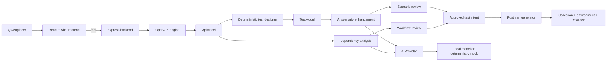
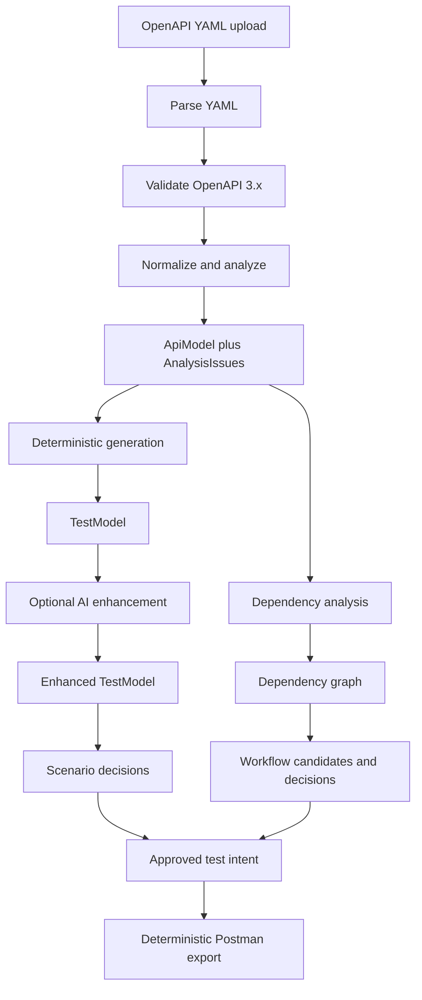
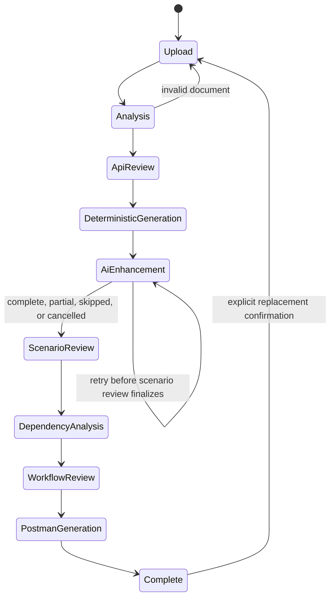

# ApiPilot Architecture

## Purpose

ApiPilot turns OpenAPI 3.x YAML into reviewable API test intent and a deterministic Postman export.
It is designed around a stable, framework-independent domain model so the current Postman target
does not define the product's internal representation or future execution targets.

The governing rule is:

```text
Specification facts -> deterministic derivations -> AI inferences -> human decisions -> artifacts
```

Each category remains distinguishable. AI never becomes specification truth, and artifact generation
never adds unapproved test intent.

## System context



The frontend and backend consume the same contracts from `packages/shared-domain`. The browser
does not call an AI runtime directly; the backend is the sole owner of provider selection, local
model lifecycle, batching, request queueing, and diagnostics.

## Repository topology

| Path                                  | Ownership and responsibility                                                                                                                   |
| ------------------------------------- | ---------------------------------------------------------------------------------------------------------------------------------------------- |
| `backend/src/app.ts`                  | Express application composition, middleware, routes, and centralized error mapping.                                                            |
| `backend/src/server.ts`               | Environment loading, configuration, process startup, and HTTP listening.                                                                       |
| `backend/src/api/`                    | Thin HTTP adaptation: parse/validate request shape, invoke domain capability, map result.                                                      |
| `backend/src/openapi/`                | YAML parsing, OpenAPI validation, internal reference resolution, normalization, analysis, and `ApiModel` construction. Independent of Express. |
| `backend/src/testDesign/`             | Pure deterministic rules, values, assertions, deduplication, AI scenario validation/enhancement, and review-facing test transformations.       |
| `backend/src/ai/`                     | `AIProvider` implementations, configuration, readiness, serial queue, model loading, batching utilities, local inference, and benchmarks.      |
| `backend/src/dependencies/`           | Conservative relationship classification, evidence capture, dependency graph, and workflow assembly.                                           |
| `backend/src/postman/`                | Collection/environment/document rendering and collection validation.                                                                           |
| `backend/src/testGenerationWorkflow/` | In-memory orchestration state machine, stage gating, invalidation, and workflow lifecycle.                                                     |
| `frontend/src/pages/`                 | The guided workflow composition root.                                                                                                          |
| `frontend/src/components/`            | Reusable and stage-specific accessible presentation and interaction components.                                                                |
| `frontend/src/services/`              | HTTP clients and backend result adaptation. Components do not scatter API calls.                                                               |
| `packages/shared-domain/src/`         | Canonical framework-neutral contracts: API, test model, AI provider, review, dependency, workflow, and Postman artifact concepts.              |

## Domain pipeline



### OpenAPI to `ApiModel`

The OpenAPI module accepts one YAML document and targets OpenAPI 3.x. It extracts every defined
operation, parameter, request body, response/status/schema, security requirement, constraint, and
example into `ApiModel`. Same-document `$ref` values may be resolved; external files and URLs are
never fetched. Invalid YAML/version, oversized input, unresolved references, circular references,
unsupported constructs, and ambiguity yield typed errors or visible `AnalysisIssue`s. The module
does not use AI, execute specification content, or invent missing contract information.

### `ApiModel` to deterministic `TestModel`

Deterministic rules construct a framework-independent scenario collection. A positive case exists
for each operation. Constraint-specific rules add applicable required-field, null, empty, invalid
type, invalid format/pattern, invalid enum, numeric boundary, string boundary, and array boundary
coverage. Path parameters intentionally omit missing/null/empty cases.

Assertions use only documented status codes and schemas. Identical request/assertion combinations
are deduplicated per operation, retaining the contributing provenance. The designer skips and
reports unresolved source portions instead of manufacturing tests.

### AI enhancement

AI scenario design receives an `ApiModel`, its deterministic baseline, and an `AIProvider`. It
requests semantic candidates, not a replacement suite. The pipeline is:

```text
bounded prompt -> provider result -> structural validation -> semantic validation against full ApiModel
-> deterministic deduplication -> enhanced TestModel -> review
```

Candidates cannot add executable endpoints, methods, parameters, fields, security schemes, or
status codes absent from the model. Valid AI provenance includes rationale, bounded confidence,
assumptions, provider/model identity, and candidate identity when available. Invalid or
non-executable candidates stay outside the executable scenario set with an explainable result.

### Dependency workflows

Dependency analysis operates on `ApiModel`, not on Postman structures. It looks for fields produced
by one operation and consumed by another, classifies each relationship as `CONFIRMED`, `LIKELY`, or
`POSSIBLE`, and preserves supporting evidence. Field-name similarity alone is insufficient for
confirmed/likely classification. AI may corroborate semantic relationships behind `AIProvider`, but
deterministic evidence stays primary when both discover the same field pair.

Only confirmed and likely edges are eligible for automatic workflow assembly. Assembly uses stable
tie-breaks, preserves every excluded candidate in the graph, orders producers before consumers, and
rejects cycles or unresolved ordering rather than reordering silently. Named workflow variables
identify the producer response field and consumer request location.

### Approved intent to Postman artifacts

The Postman generator accepts only approved scenarios. It produces a collection, environment, and
human-readable artifact document in one action, validates the collection before delivery, and is
fully deterministic for identical input. Every request uses variables for base URL, credentials,
and unknown values. No real credential belongs in the collection or diagnostics; supplied values can
appear only in the marked-sensitive environment artifact.

The generator preserves an approved negative payload as-is and translates only approved assertions.
No assertion or expected status is added merely to make an export look complete. It reports empty
approval sets, unsupported auth/content types, missing expected outcomes, and analysis issues as
limitations. Current export is single-operation only; ordered multi-step workflow rendering is a
defined future extension.

## Workflow orchestration

`testGenerationWorkflow/` coordinates the pipeline without reimplementing its domain rules. It
holds exactly one globally shared workflow in backend process memory.



Every stage is guarded by its required output. Stage state is visible as not-yet-reached, active,
complete, stale, or skipped; skipped AI enhancement may become active again before scenario review
is finalized. Changing an upstream decision invalidates dependent completed stages, marks them
stale, and blocks artifact download until regenerated. State survives browser reloads while the
backend remains alive, but not backend restarts.

## AI subsystem

### Provider boundary

All AI consumers use the shared `AIProvider` contract. Local Transformers.js inference is isolated
in the local provider; tests normally use a deterministic mock or scripted fake provider. Provider
states are explicit: `not-loaded`, `loading`, `ready`, and `unavailable`. Requests queue FIFO and
run serially. Load failures are surfaced, require explicit retry, and never trigger a cloud
fallback. CPU is the guaranteed mode; an explicitly enabled unavailable accelerator falls back to
CPU with a notice.

### Batching, viability, and pacing

AI work must be bounded by the local model's real capacity and by user-tolerable time. The design
uses deterministic units of operations, serial requests, and stable merge/deduplication. Each
operation appears in exactly one unit. A run can be fully complete, partial, skipped/not-completed,
or cancelled; deterministic scenarios and relationships always remain intact.

Current hardening work improves the local CPU path by applying model-specific conversational
framing, ending generation at EOS, determining actual positional capacity conservatively, reducing
prompt material without narrowing full-model validation, and sizing output to the time budget. It
also applies work-bounded units per caller (smaller for scenario enhancement, larger for dependency
analysis), a run-level ceiling, viability refusal before hopeless work, visible preparation versus
generation phases, elapsed time, boundary-based cancellation, and plain-language failure guidance.

Progress exposes batch/unit counts and outcomes but never raw specifications, prompts, or model
responses. Successful enhancement units can reveal scenarios incrementally; their review decisions
remain intact when later units settle differently.

## Security, privacy, and operational constraints

- Uploaded specifications are potentially sensitive. The system validates size/content and neither
  executes them nor follows arbitrary filesystem/network references.
- Specifications, credentials, raw prompts, raw model responses, and complete request payloads are
  excluded from ordinary diagnostics. Logs favor stage, category, duration, model identity, and
  correlation context.
- ApiPilot does not call the target APIs described in a specification during analysis, generation,
  review, dependency detection, or export. Generating a collection is not authorization to execute
  it.
- Local-only operation never silently transfers inference inputs externally. The current provider
  modes are local and mock.
- The initial product is single-user, in-memory, and non-persistent. No external queue, database,
  authentication system, or cloud AI provider is part of the core architecture.

## Frontend architecture

The frontend is a React/Vite technical workspace, not a set of independent stage pages. The page
composition root renders the active guided stage and its shared progress/state. Components own
presentation, interaction, local UI state, accessible names, keyboard behavior, and visible focus.
Service modules own HTTP transport. Shared domain types preserve a type-safe boundary instead of
duplicating backend/frontend representations.

Data-driven views distinguish loading, populated, empty, and error states. Review remains usable at
real API scale through filtering, bulk selection, explicit confirmations, visible progress, and
per-item decision records. State, severity, provenance, HTTP methods, and errors use consistent
visual semantics and are never communicated through color alone.

## Deployment and validation

Vercel deploys `frontend` and `backend` as separate services. [vercel.json](../vercel.json) rewrites
`/api/*` to the backend and other paths to the frontend. Locally, `npm run dev` starts both services
and the Vite development proxy keeps browser API calls same-origin.

Primary verification commands run from repository root:

```powershell
npm test
npm run lint
npm run build
```

Tests target transformations at their owning boundary: pure domain unit tests, Supertest backend
integration tests, React Testing Library frontend tests, and mock-provider AI paths. Real-model
tests and benchmarks are opt-in because they may provision or load a local model.

## Normative sources

The architecture is governed by [the constitution](../specs/constitution.md). The complete
feature-level behavior, contracts, success criteria, and implementation status live in the
[roadmap](../specs/ROADMAP.md) and feature directories under `specs/001-*` through `specs/014-*`.
Where this document and a feature specification differ, the applicable specification and
constitution take precedence.
