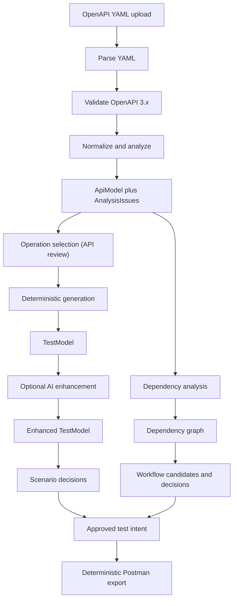
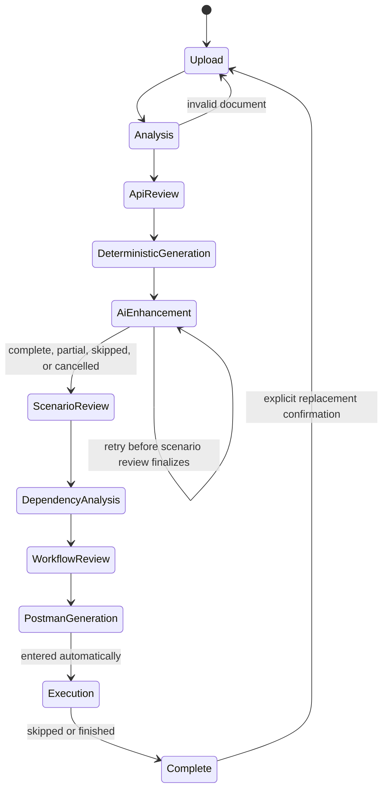

# ApiPilot Architecture

## Purpose

ApiPilot turns OpenAPI 3.x YAML into reviewable API test intent and a deterministic Postman export.
It is designed around a stable, framework-independent domain model so the current Postman target
does not define the product's internal representation or future execution targets.

The governing rule is:

```text
Specification facts -> deterministic derivations -> AI inferences -> human decisions -> artifacts
```

Each category remains distinguishable. AI never becomes specification truth, and artifact generation
never adds unapproved test intent.

## System context

```mermaid
flowchart LR
  QA["QA engineer"] --> UI["React + Vite frontend"]
  UI -->|"/api"| API["Express backend"]
  API --> OAI["OpenAPI engine"]
  OAI --> AM["ApiModel"]
  AM --> TD["Deterministic test designer"]
  TD --> TM["TestModel"]
  TM --> AI["AI scenario enhancement"]
  AM --> DEP["Dependency analysis"]
  AI --> REVIEW["Scenario review"]
  DEP --> WREVIEW["Workflow review"]
  REVIEW --> APPROVED["Approved test intent"]
  WREVIEW --> APPROVED
  APPROVED --> PM["Postman generator"]
  PM --> ART["Collection + environment + README"]
  ART --> EXEC["Execution (Newman)"]
  ART -->|"UI hand-off"| EXTC
  EXEC --> RESULTS["Execution results"]
  AI --> PROVIDER["AIProvider"]
  DEP --> PROVIDER
  PROVIDER --> LOCAL["Local model or deterministic mock"]
  EXEC --> DB[("SQLite: environments, run history, AI diagnostics")]
  UI --> EXTC["Collection import, editing & execution"]
  EXTC -->|"shares Newman dispatch"| EXEC
  EXTC --> DB
```



The frontend and backend consume the same contracts from `packages/shared-domain`. The browser
does not call an AI runtime directly; the backend is the sole owner of provider selection, local
model lifecycle, batching, request queueing, and diagnostics.

## Repository topology

| Path                                  | Ownership and responsibility                                                                                                                   |
| ------------------------------------- | ---------------------------------------------------------------------------------------------------------------------------------------------- |
| `backend/src/app.ts`                  | Express application composition, middleware, routes, and centralized error mapping.                                                            |
| `backend/src/server.ts`               | Environment loading, configuration, process startup, and HTTP listening.                                                                       |
| `backend/src/api/`                    | Thin HTTP adaptation: parse/validate request shape, invoke domain capability, map result.                                                      |
| `backend/src/openapi/`                | YAML parsing, OpenAPI validation, internal reference resolution, normalization, analysis, and `ApiModel` construction. Independent of Express. |
| `backend/src/testDesign/`             | Pure deterministic rules, values, assertions, deduplication, AI scenario validation/enhancement, and review-facing test transformations.       |
| `backend/src/ai/`                     | `AIProvider` implementations, configuration, readiness, serial queue, model loading, batching utilities, local inference, and benchmarks.      |
| `backend/src/dependencies/`           | Conservative relationship classification, evidence capture, dependency graph, and workflow assembly.                                           |
| `backend/src/postman/`                | Collection/environment/document rendering and collection validation.                                                                           |
| `backend/src/testGenerationWorkflow/` | In-memory orchestration state machine, stage gating, invalidation, and workflow lifecycle — keyed per session by `backend/src/session/`.       |
| `backend/src/session/`                | Per-browser session identity: unguessable cookie issuance, `AsyncLocalStorage` request context, and idle-session eviction (specs/017-session-workflow-isolation). |
| `backend/src/execution/`              | Environment/execution-run domain logic and stores; delegates durable reads/writes to `backend/src/persistence/` repositories (specs/018, specs/025).            |
| `backend/src/externalCollections/`    | Standalone upload/store/execute path for an externally-authored Postman collection/environment pair, sibling to `execution/` rather than an extension of it (specs/026-external-collection-execution). Reuses `execution/newmanRunner.ts`'s dispatch unchanged; maps results through its own, narrower mapper rather than `execution/mapNewmanResult.ts`, since an uploaded collection's arbitrary named tests have no `TestScenario` to interpret them against. |
| `backend/src/persistence/`            | SQLite (`better-sqlite3`) connection, schema initialization, and repositories for environments, execution run history, uploaded collections/runs, and AI readiness/benchmark diagnostics; at-rest credential encryption (specs/025-local-persistence-layer, specs/026-external-collection-execution). |
| `frontend/src/pages/`                 | Composition roots for the guided workflow and the collection import/editing/execution view.                                                    |
| `frontend/src/components/`            | Reusable and stage-specific accessible presentation and interaction components.                                                                |
| `frontend/src/services/`              | HTTP clients and backend result adaptation. Components do not scatter API calls.                                                               |
| `packages/shared-domain/src/`         | Canonical framework-neutral contracts: API, test model, AI provider, review, dependency, workflow, and Postman artifact concepts.              |

## Domain pipeline



### OpenAPI to `ApiModel`

The OpenAPI module accepts one YAML document and targets OpenAPI 3.x. It extracts every defined
operation, parameter, request body, response/status/schema, security requirement, constraint, and
example into `ApiModel`. Same-document `$ref` values may be resolved; external files and URLs are
never fetched. Invalid YAML/version, oversized input, unresolved references, circular references,
unsupported constructs, and ambiguity yield typed errors or visible `AnalysisIssue`s. The module
does not use AI, execute specification content, or invent missing contract information.

### Operation selection

API review records the operations the user chooses to test as
`TestGenerationWorkflow.selectedOperationKeys` — `"METHOD /path"` keys produced by shared-domain
`toOperationKey()`, normalized to `apiModel.operations` order (specs/009 Clarifications
2026-09-23). The selection lives on the workflow rather than on `ApiModel`/`ApiOperation`, so the
AP-002 contract and the OpenAPI engine are unchanged. `scopeApiModelToSelection()`
(`backend/src/testGenerationWorkflow/operationSelection.ts`) narrows only `operations`, and is
applied by deterministic generation, AI enhancement, and single-batch retry. Because each operation
already carries its resolved schemas, narrowing operations also narrows what reaches the AI
provider. The stored `apiModel` is never narrowed, so later stages that legitimately reference
unselected operations (for example auth-credential chaining to a token endpoint, specs/023) are
unaffected. Unknown keys are refused with `unknown_operation_key` rather than dropped, an absent or
empty selection means every operation (the pre-amendment behavior), and the selection cannot be
revised within a workflow.

### `ApiModel` to deterministic `TestModel`

Deterministic rules construct a framework-independent scenario collection. A positive case exists
for each operation. Constraint-specific rules add applicable required-field, null, empty, invalid
type, invalid format/pattern, invalid enum, numeric boundary, string boundary, and array boundary
coverage. Path parameters intentionally omit missing/null/empty cases.

Assertions use only documented status codes and schemas. Identical request/assertion combinations
are deduplicated per operation, retaining the contributing provenance. The designer skips and
reports unresolved source portions instead of manufacturing tests.

### AI enhancement

AI scenario design receives an `ApiModel`, its deterministic baseline, and an `AIProvider`. It
requests semantic candidates, not a replacement suite. The pipeline is:

```text
bounded prompt -> provider result -> structural validation -> semantic validation against full ApiModel
-> deterministic deduplication -> enhanced TestModel -> review
```

Candidates cannot add executable endpoints, methods, parameters, fields, security schemes, or
status codes absent from the model. Valid AI provenance includes rationale, bounded confidence,
assumptions, provider/model identity, and candidate identity when available. Invalid or
non-executable candidates stay outside the executable scenario set with an explainable result.

### Dependency workflows

Dependency analysis operates on `ApiModel`, not on Postman structures. It looks for fields produced
by one operation and consumed by another, classifies each relationship as `CONFIRMED`, `LIKELY`, or
`POSSIBLE`, and preserves supporting evidence. Field-name similarity alone is insufficient for
confirmed/likely classification. AI may corroborate semantic relationships behind `AIProvider`, but
deterministic evidence stays primary when both discover the same field pair.

Only confirmed and likely edges are eligible for automatic workflow assembly. Assembly uses stable
tie-breaks, preserves every excluded candidate in the graph, orders producers before consumers, and
rejects cycles or unresolved ordering rather than reordering silently. Named workflow variables
identify the producer response field and consumer request location.

### Approved intent to Postman artifacts

The Postman generator accepts only approved scenarios. It produces a collection, environment, and
human-readable artifact document in one action, validates the collection before delivery, and is
fully deterministic for identical input. Every request uses variables for base URL, credentials,
and unknown values. A path parameter with no approved value is exposed as a resource-qualified
variable — the singular of the static segment before it plus the parameter name, so
`/users/{id}` references `{{user_id}}` — unless the parameter already names its resource or no
static segment precedes it (`pathParameterVariableName` in
`backend/src/postman/artifactVariables.ts`, specs/007 Clarifications 2026-09-23). The request's
Postman `:name` path key keeps the specification's own parameter name. No real credential belongs in the collection or diagnostics; supplied values can
appear only in the marked-sensitive environment artifact.

The generator preserves an approved negative payload as-is and translates only approved assertions.
No assertion or expected status is added merely to make an export look complete. It reports empty
approval sets, unsupported auth/content types, missing expected outcomes, analysis issues, and
unsupported workflow representations remain visible as limitations. When AP-016 workflow context
is present, explicitly approved and supportable integration workflows are rendered as deterministic
ordered folders. Producer response fields are extracted into workflow-scoped variables and
referenced by later approved requests; unsupported workflows are omitted atomically. Workflow
requests and variables retain source workflow, step, scenario, and relationship provenance.
Standalone scenarios not covered by a rendered workflow continue to use the existing folder layout.

Four further hardening features refine this export path. A standalone scenario's unresolved path
parameter can be automatically resolved from a `CONFIRMED`/`LIKELY` producer's response value —
single-hop only, skippable via an export option — without requiring a pre-approved workflow
(AP-019, `backend/src/postman/automaticChaining.ts`). Each distinctly-keyed security scheme gets
its own credential variable instead of colliding on one shared name, and candidate
credential-producing operations are identified for later chaining (AP-021,
`backend/src/postman/credentialProducers.ts`). That chaining is then completed for authentication
specifically — a token or API key obtained from one operation's response is wired into the
`Authorization` variable of operations that need it, excluding `http`/`basic` schemes (AP-023,
`backend/src/postman/authCredentialRelationships.ts`). OpenAPI `oauth2` schemes using the
`clientCredentials` flow are recognized and rendered as a prepended "OAuth2 Token Setup" folder
containing one synthesized token-fetch request per scheme, always included regardless of the
chaining opt-out (AP-024, `backend/src/postman/oauth2TokenFetch.ts`). Separately, array/object
query, header, and path parameters render per their declared OpenAPI `style`/`explode` rules with
percent-encoding rather than being JSON-stringified; unsupported styles (`matrix`, `label`,
content-based) are reported as a limitation instead of guessed (AP-022,
`backend/src/postman/parameterSerialization.ts`).

## Workflow orchestration

`testGenerationWorkflow/` coordinates the pipeline without reimplementing its domain rules. It
holds exactly one in-progress workflow per browser session in backend process memory
(specs/017-session-workflow-isolation, superseding the original single-process-wide-instance
design from specs/009). A new Express middleware (`backend/src/session/sessionMiddleware.ts`)
assigns each browser an unguessable, cryptographically random session identifier via an
`httpOnly` cookie and runs the rest of the request inside a `node:async_hooks`
`AsyncLocalStorage` context; `workflowStore.ts` reads that context internally, so no route or
pipeline module needed to change to become session-aware. Concurrent sessions never see or
affect each other's workflow, and a session idle for over 60 minutes is evicted — its next visit
is told explicitly that its session expired, rather than shown an indistinguishable empty state.
The underlying `AIProvider` (readiness, model, and serial inference queue) remains one shared,
process-wide resource, unaffected by this per-session isolation.



`execution` (specs/009 Clarifications 2026-09-20) is the tenth stage and the only optional one
after AI enhancement: it may be skipped or finished after zero or more runs. In the current UI it
runs nothing itself. Continuing from Postman generation hands the generated collection and
environment to the "Import & Run Collection" view (`App.tsx`'s `handleHandoffToExecution`,
`frontend/src/services/importPreload.ts`), pre-filling its upload form; the operator still chooses a
risk tier and submits, after which the collection is an ordinary `UploadedCollectionSet`. The
`execution` stage screen only offers a button to repeat the hand-off, for example after a reload.
The guided workflow's own environment and execution routes (specs/018) remain mounted but have no
UI caller. This hand-off is not yet described in specs/009 or specs/018.

Scenario review has one extra guard. `finalizeScenarioReview` marks `scenarioReview` complete and
activates `dependencyAnalysis` before awaiting the analysis, so a decision, edit, or regeneration
arriving in that window would land after the approved suite was already projected.
`scenarioReviewStage.ts` refuses such requests with `stage_not_active` while
`scenarioReview` is complete and `dependencyAnalysis` is still active, and re-checks after an AI
regeneration returns. The frontend disables the review controls for the same window and holds
"Finalize Review" while any decision is still in flight.

Every stage is guarded by its required output. Stage state is visible as not-yet-reached, active,
complete, stale, or skipped; skipped AI enhancement may become active again before scenario review
is finalized. Changing an upstream decision invalidates dependent completed stages, marks them
stale, and blocks artifact download until regenerated. A session's state survives that browser's
reloads and additional tabs while the backend remains alive, but not backend restarts or a
60-minute idle period.

## AI subsystem

### Provider boundary

All AI consumers use the shared `AIProvider` contract. Local Transformers.js inference is isolated
in the local provider; tests normally use a deterministic mock or scripted fake provider. Provider
states are explicit: `not-loaded`, `loading`, `ready`, and `unavailable`. Requests queue FIFO and
run serially. Load failures are surfaced, require explicit retry, and never trigger a cloud
fallback. CPU is the guaranteed mode; an explicitly enabled unavailable accelerator falls back to
CPU with a notice.

The accelerator device string is platform-specific rather than one generic value: on Windows, the
local provider requests DirectML (`dml`) directly rather than Transformers.js's generic `"gpu"`
value, because that generic value resolves to an execution-provider combination
(`["dml", "webgpu"]`) that onnxruntime-node's DirectML backend rejects outright, which previously
made the accelerator fall back to CPU on every Windows run regardless of real GPU availability
(`backend/src/ai/localProvider.ts`'s `resolveAcceleratorDevice()`; see
[specs/004-ai-provider-local-inference/research.md](../specs/004-ai-provider-local-inference/research.md)
Decision 6 addendum).

### Batching, viability, and pacing

AI work must be bounded by the local model's real capacity and by user-tolerable time. The design
uses deterministic units of operations, serial requests, and stable merge/deduplication. Each
operation appears in exactly one unit. A run can be fully complete, partial, skipped/not-completed,
or cancelled; deterministic scenarios and relationships always remain intact.

Current hardening work improves the local CPU path by applying model-specific conversational
framing, ending generation at EOS, determining actual positional capacity conservatively, reducing
prompt material without narrowing full-model validation, and sizing output to the time budget. It
also applies work-bounded units per caller (smaller for scenario enhancement, larger for dependency
analysis), a run-level ceiling, viability refusal before hopeless work, visible preparation versus
generation phases, elapsed time, boundary-based cancellation, and plain-language failure guidance.

Progress exposes batch/unit counts and outcomes but never raw specifications, prompts, or model
responses. Successful enhancement units can reveal scenarios incrementally; their review decisions
remain intact when later units settle differently.

A batch whose reply cannot be parsed gets exactly one immediate retry with an appended corrective
instruction, before that batch is recorded as failed — applied uniformly to both AI-assisted
passes (dependency analysis was brought to parity with scenario enhancement's existing retry).
This absorbs a one-off malformed generation without masking a genuinely unavailable provider,
since only one retry is attempted per batch.

### Hardware and resource footprint

No GPU is required for any ApiPilot capability. Local inference runs on CPU by design;
`AI_USE_ACCELERATOR` defaults to `false`, and an explicitly enabled but unavailable accelerator
falls back to CPU with a visible notice rather than failing silently. When a real accelerator is
present and enabled, Windows uses DirectML (see "Provider boundary" above); other platforms use
Transformers.js's generic GPU device resolution (CUDA on Linux x64, CoreML on macOS).

The project's own benchmark harness (`npm run ai:benchmark -w backend`, recorded in
[specs/004-ai-provider-local-inference/benchmark-results.json](../specs/004-ai-provider-local-inference/benchmark-results.json))
measured the selected default model (`onnx-community/Qwen2.5-0.5B-Instruct`, fp32) at roughly
2.75 GB peak process RSS and ~12.7s average latency per representative workload on the reference
CPU profile also used to calibrate `AI_INFERENCE_TIMEOUT_MS` and `AI_ENHANCEMENT_RUN_BUDGET_MS` in
`backend/src/ai/modelConfig.ts`. 4 GB of free RAM is a reasonable minimum for running local AI.
`AI_PROVIDER_MODE=mock` (the automated-test default) needs no model process and adds no
meaningful memory beyond the Node/Express and Vite dev servers themselves.

First use of local AI downloads and caches the model — about 1.7 GB for the default model at
fp32, under `AI_MODEL_CACHE_DIR` (`~/.apipilot/models` by default). `.env.example` documents why
`AI_MODEL_DTYPE` should stay unset on CPU: measured q8 quantization was roughly 4x slower than
fp32 on the reference profile and produced malformed structured output. Local AI operates fully
offline once the model is cached.

## Local persistence

`backend/src/persistence/` (specs/025-local-persistence-layer) gives three categories of data,
previously held only in in-memory maps, a local SQLite (`better-sqlite3`) file that survives a
backend restart: `Environment` definitions and their credential configuration, `ExecutionRun`
history (status, timing, per-request results), and the AI subsystem's readiness-state and
benchmark-result history. `backend/src/execution/environmentStore.ts` and
`executionRunStore.ts` delegate their reads/writes to dedicated repositories
(`environmentRepository.ts`, `executionRunRepository.ts`, `aiDiagnosticsRepository.ts`) rather than
exposing SQLite directly to callers. The database file initializes itself idempotently on first
use (`CREATE TABLE IF NOT EXISTS`); a corrupted or unreadable file fails startup explicitly instead
of being silently discarded.

Persistence lifetime follows the existing session model rather than replacing it: an environment or
execution run survives a restart only for as long as its owning browser session remains active, and
is removed when that session is idle-evicted (specs/017-session-workflow-isolation's unchanged
60-minute timeout) — not retained indefinitely or across sessions. Execution run history itself is
never automatically pruned within that window. AI readiness/benchmark history is process-wide, not
session-scoped, and persists independently of any session. An execution run left in progress when
the backend stops is recorded on restart as cancelled with a `cancelReason` of
`"backend-restart"`, distinguishable in run history from a user-initiated cancellation.

Guided-workflow generation state (`backend/src/testGenerationWorkflow/workflowStore.ts`) and the
session registry itself (`backend/src/session/sessionRegistry.ts`) are deliberately **not** part of
this feature and remain in-memory-only `Map`s — an in-progress workflow still does not survive a
backend restart.

`Environment.variableValues` — the field carrying credential-like values — is encrypted at rest
with AES-256-GCM (`backend/src/persistence/credentialCipher.ts`, Node's built-in `node:crypto`,
chosen over adding a dependency). The symmetric key lives in a sibling file next to the database
(not inside it), so a copied database file alone cannot be decrypted; both files must be backed up
together. No credential value ever appears in plaintext in logs, error responses, or diagnostics.
The database location is configurable via `APIPILOT_DB_PATH` (default
`~/.apipilot/apipilot.db`); automated tests use an isolated location, never the location a real
running instance uses.

## External collection import & execution

`backend/src/externalCollections/` (specs/026-external-collection-execution) is a parallel,
"bring your own artifact" capability rather than an extension of the OpenAPI-driven pipeline above
— it deliberately does not flow through `ApiModel`/`TestModel`, and requires no active
`TestGenerationWorkflow`. An operator uploads a Postman Collection v2.1 JSON file and a Postman
Environment JSON file directly (or submits the pair pre-filled by the guided workflow's hand-off,
which the backend treats identically); both are validated with the real `postman-collection` SDK
(constitution XXVIII — reuse the standard implementation rather than a custom schema check) instead
of a hand-rolled check.

`runUploadedCollectionExecution.ts` walks the parsed `Collection` via its own `forEachItem()`
method, which visits every request at any folder nesting depth in the collection's own document
order, and converts each visited item into `PostmanRawItem` (`packages/shared-domain/src/
externalCollections.ts`) — a type deliberately separate from `postmanArtifact.ts`'s generator-only
`PostmanRequestItem`/`PostmanEvent`, which can represent only a `"test"` script event and a `"raw"`
body mode because that is all ApiPilot's own generator ever emits. An uploaded collection may
legitimately use a `"prerequest"` script event, a non-`"raw"` body mode, or an auth scheme outside
the four the generator configures, so `PostmanRawItem` widens exactly that boundary rather than
stretching the generator's own type past its documented purpose. `execution/newmanRunner.ts`'s
`runSingleItem()` is reused unchanged for dispatch — its signature was widened (not behaviorally
modified) to accept either item type, since `newman.run()` already accepts either shape as plain
JSON.

Result *interpretation* is not shared with the generated-collection path: `mapUploadedResult.ts`
reads `testOutcomes` directly off Newman's own `execution.assertions[]`, naming each test exactly
as the collection's own `pm.test(...)` script named it, rather than forcing it through
`mapNewmanResult.ts`'s `TestScenario`-typed `"status-code"`/`"schema-conformance"` vocabulary — an
uploaded collection's tests have no `TestScenario` to interpret them against, and guessing a
classification the collection never declared would itself violate constitution I/XIV. The two
result/run shapes (`UploadedRequestResult`/`UploadedCollectionExecutionRun`) are consequently
distinct sibling types, kept structurally parallel to but not merged with AP-017's own
`RequestResult`/`ExecutionRun`, which remain completely unmodified.

Two independent confirmation gates apply before a run starts: an unverified-content gate (FR-007),
evaluated only while the uploaded collection has never before been confirmed and permanently
satisfied once accepted, then the same staging/production/destructive-request gate the
guided-workflow execution path already has (FR-013), evaluated on every run start. A brand-new
upload against a risky tier requires two separate confirmed resubmissions, one per gate, rather
than one submission silently satisfying both. Uploaded-collection runs and guided-workflow runs
share the same single session-wide "one execution in progress at a time" slot, enforced by a
small cross-check in each path's own route rather than merging their two separate stores/tables.

An unresolved variable does not gate a run (specs/026 FR-004, superseded 2026-09-23). The original
`400 missing_variable_values` refusal prevented collections whose later requests depend on a value
an earlier request's test script captures with `pm.environment.set`, and it could not see
variables set by scripts at all. Unresolved variables are instead surfaced before the run
(`CollectionView.unresolvedVariables` and the variable panel), and a request that still sends one
records its own outcome. The generated-collection `execution/start` keeps its refusal. During a run,
`runUploadedCollectionExecution.ts` writes the environment Newman returns after each item back to
the collection's stored `variableValues` (`updateUploadedCollectionVariables`), so the resolved
preview and later runs reflect captured values rather than silently diverging from what was sent.

Executing the collection's own pre-request/test scripts inside Newman's existing sandboxed script
engine — the same engine `newmanRunner.ts` already invokes for every generated request — required
a narrow, explicit amendment to constitution XVII ("avoid executing uploaded specifications or
generated scripts on the server"), gated behind the FR-007 confirmation above and scoped only to
this feature; it does not apply to ApiPilot-generated artifacts, AI output, or uploaded OpenAPI
specifications, and no new sandboxing layer was introduced.

The frontend's "Import & Run Collection" view (`frontend/src/pages/ExternalCollectionsPage.tsx`) is
a sibling top-level view to the guided workflow. `App.tsx` starts on an entry chooser; the tab bar
between the two views is hidden while the guided workflow is in progress and shown for "Import &
Run Collection" and after the hand-off. Visibility is toggled rather than unmounting, so switching
views keeps each one's in-progress state. The guided workflow page stays mounted for the rest of
the session once first reached, even across "Back to start": its resume-on-mount effect repeats
the hand-off for a workflow already at `execution`, guarded by a per-instance `useRef`, and
remounting would reset that guard and bounce the user straight back to "Import & Run Collection".
The external collections page is unmounted on "Back to start". No routing library was introduced,
mirroring the guided workflow's own original decision against one for stage navigation.

## Security, privacy, and operational constraints

- Uploaded specifications are potentially sensitive. The system validates size/content and neither
  executes them nor follows arbitrary filesystem/network references.
- The one narrow exception to "never execute uploaded content" is a user-initiated, explicitly
  confirmed run of an uploaded Postman collection's own scripts, inside Newman's existing sandbox
  (specs/026-external-collection-execution, constitution XVII amendment). It does not extend to
  OpenAPI specifications, ApiPilot-generated artifacts, or AI output.
- Specifications, credentials, raw prompts, raw model responses, and complete request payloads are
  excluded from ordinary diagnostics. Logs favor stage, category, duration, model identity, and
  correlation context. A request-completion log records only method/path/status/duration/client
  IP (`backend/src/app.ts`); by default the client IP is the direct TCP peer (the Vite dev proxy's
  own loopback address for proxied requests), not the browser's real address. The debug-only
  `DEBUG_LOG_REAL_CLIENT_IP` flag trusts that proxy's `X-Forwarded-For` header instead — Express's
  `trust proxy` is scoped to `loopback` only when this flag is enabled, so it must never be turned
  on behind a real reverse proxy without also restricting `trust proxy` to that proxy's actual
  address, or a client could spoof its own logged IP.
- ApiPilot does not call the target APIs described in a specification during analysis, generation,
  review, dependency detection, or export. Generating a collection is not authorization to execute
  it.
- Local-only operation never silently transfers inference inputs externally. The current provider
  modes are local and mock.
- The product isolates concurrent browser sessions (an unguessable cookie identity, evicted after
  60 minutes idle) but has no login/account system, and guided-workflow generation state remains
  in-memory and non-persistent. Environments, execution run history, and AI diagnostics are
  persisted to a local, embedded SQLite database (see "Local persistence" above) — not an external
  or shared one. No external queue, networked database, authentication system, or cloud AI
  provider is part of the core architecture.
- Frontend runtime errors are captured by global `window` handlers and forwarded, best-effort, to
  a dedicated backend endpoint (`POST /api/client-logs`) that persists them through the existing
  server-side logger under a distinct component name (specs/020-frontend-application-logging). A
  credential-shaped field-name denylist is enforced independently on both sides; forwarding never
  blocks the UI and is never retried, and nothing is sent to an external service.

## Frontend architecture

The frontend is a React/Vite technical workspace, not a set of independent stage pages. `App.tsx`
switches between two top-level views — the guided workflow and the collection import/editing/
execution page (specs/026, specs/028) — without discarding either one's state when the other is
active (see "External collection import & execution" above for the mounting rules). Within the
guided workflow, the page composition root
renders the active guided stage and its shared progress/state. Components own
presentation, interaction, local UI state, accessible names, keyboard behavior, and visible focus.
Service modules own HTTP transport. Shared domain types preserve a type-safe boundary instead of
duplicating backend/frontend representations.

Data-driven views distinguish loading, populated, empty, and error states. Review remains usable at
real API scale through filtering, bulk selection, explicit confirmations, visible progress, and
per-item decision records. State, severity, provenance, HTTP methods, and errors use consistent
visual semantics and are never communicated through color alone.

### Design system and application shell

specs/027-frontend-design-system establishes the presentation layer every page builds on, without
changing any backend contract, workflow rule, or existing page behavior (its own FR-012). Design
tokens — color, typography, spacing, radius, shadow — live in `frontend/src/index.css` under a
Tailwind v4 `@theme` block rather than a `tailwind.config.js` (CLAUDE.md §27). Dark mode is not
purely a media-query default: `useTheme.ts` resolves an explicit, per-browser choice (`localStorage`,
falling back to the OS preference) and writes it to a `data-theme` attribute on `<html>`; a
`@custom-variant dark` declaration keys every `dark:` Tailwind utility off that attribute instead of
`prefers-color-scheme` directly, so an in-app choice that disagrees with the OS preference does not
leave the page half-switched. `ThemeToggle.tsx` exposes the manual switch; `index.html` sets the same
attribute synchronously before first paint to avoid a flash of the wrong theme.

A shared component library gives recurring concepts one implementation instead of one per page:
`StatusBadge`, `HttpMethodBadge`, and `ProvenanceBadge` for decision/status, HTTP method, and
AI-vs-deterministic provenance indicators; `Dialog`/`ConfirmDialog` and `Tabs` for interaction
chrome; `EmptyState`, `ErrorState`, and `Skeleton` for the loading/empty/error triad; and
`controlStyles.ts` for shared button/input variants. `WorkflowStageTracker.tsx` is the one reusable
workflow-progress indicator, presenting the product's real ten-stage order (Upload through
Execution) with completed/active/pending/locked status and an explanation for why a locked stage is
unavailable, rather than each page building its own progress display. Every status/decision
indicator carries a text label or icon in addition to color, and every interactive element is
keyboard-operable with a visible focus indicator (constitution/CLAUDE.md §38).

### Collection and variable editor

specs/028-collection-editor-ui adds a Postman-style pre-run editing surface — `CollectionTreeView`,
`RequestEditorPanel`, and `VariablePanel` — so an operator can see and adjust exactly what a run will
send before starting it. It is a downstream, execution-time layer: it does not change how a
collection or its underlying `TestScenario`/`GeneratedRequest` is generated (specs/003, 007, 016),
and never mutates generated provenance. Edits mutate the `UploadedCollectionSet` record in place,
with no separate override entity (specs/028 research.md D4): a variable edit replaces its
encrypted `variableValues`, and a request edit replaces the matching item in the stored collection
JSON and marks it `_apipilotEdited: true`. `mapUploadedResult.ts` copies that marker onto
`UploadedRequestResult.wasEdited`, so a run shows which requests were edited. The uploaded file
and any generated `TestScenario` behind a handed-off collection are separate and untouched, and a
re-upload creates a new record, so an edit is never silently reapplied to a different request.

Structural mutations (add, delete, rename, reorder, field edits) go through the real
`postman-collection` SDK (research.md D10). The SDK drops unrecognized properties when it parses,
so every mutation re-applies all existing edit markers when it serializes
(`serializeWithEditMarkers` in `editedItems.ts`); without that, each save would keep only the most
recently edited request's marker.

`CollectionTreeView` reproduces the collection's own folder/request order and supports add, delete,
rename, and reorder for both requests and folders. `RequestEditorPanel` is a tabbed
Headers/Body/Tests editor — method, URL, and Save stay visible across tabs, and the resolved
(variable-substituted) preview is always visible below them — covering full method/URL/header/body
editing plus the request's own `pm.test(...)` test script, which previously executed on every run
but was neither shown nor editable pre-run. `VariablePanel` lists every variable the collection
references (plus any the user defines ahead of a request that will use it), its resolved value, and
which scope currently wins — collection default, environment, or user override — updating every
visible request preview live as values change. Unresolved variables are marked missing (a dot on
the Variables toggle and each request's "Unresolved" list) but do not block a run (FR-006,
superseded 2026-09-23 together with specs/026 FR-004). The whole view becomes read-only while a run
of that collection is in progress (FR-017), enforced with a lightweight poll rather than a push
channel.

`CollectionRequestView.impliedAuthHeader` (shared-domain `ImpliedAuthHeader`) reports the header a
request's own or inherited `auth` block adds at execution time, in raw and resolved form. It is
display-only and never merged into the editable headers, since it is not a literal header entry.
It is computed only for `bearer` and header-located `apikey`, whose header value is a lossless
key/value pair; `basic` would obscure `{{variable}}` placeholders through base64 encoding, and
signed or dynamic schemes (`digest`, `oauth1`, `oauth2`, `awsv4`, `hawk`, `ntlm`, `edgegrid`)
cannot be shown as a fixed value without fabricating one. The guided workflow's scenario review
detail applies the same explainability rule: it states an operation's security requirement, since
the deterministic `GeneratedRequest` never carries auth itself.

A related addition, layered onto specs/026's execution/start rather than a new endpoint, is
selective run: an optional `selectedRequestIds` array lets the run panel's Postman-Runner-style
checklist execute a chosen subset of the collection's requests instead of always all of them.

**Known scope gap**: `CollectionTreeView`, `RequestEditorPanel`, and `VariablePanel` are mounted only
in `ExternalCollectionsPage.tsx` and operate only on `UploadedCollectionSet`. Since the execution
hand-off, a generated collection reaches them by being uploaded, but specs/028 FR-008's
generated-collection requirement (an editor over specs/018's own execution path) is still not met
as specified. Either the hand-off should be recorded as satisfying FR-008 in the spec, or the gap
stays open follow-up work.

## Deployment and validation

The repository has no checked-in deployment manifest (the former `vercel.json` was removed). The
backend compiles to `backend/dist` and the frontend builds a Vite distribution under
`frontend/dist`. Locally, `npm run dev` starts both services and the Vite development proxy keeps
browser API calls same-origin.

Primary verification commands run from repository root:

```powershell
npm test
npm run lint
npm run build
```

Tests target transformations at their owning boundary: pure domain unit tests, Supertest backend
integration tests, React Testing Library frontend tests, and mock-provider AI paths. Real-model
tests and benchmarks are opt-in because they may provision or load a local model.

## Normative sources

The architecture is governed by [the constitution](../specs/constitution.md). The complete
feature-level behavior, contracts, and success criteria live in the feature directories under
`specs/001-*` through `specs/028-*`, and [the roadmap](../specs/ROADMAP.md) tracks implementation
status through AP-028. Where this document and a feature specification differ, the applicable
specification and constitution take precedence. The execution hand-off described under "Workflow
orchestration" is the one behavior documented here that no specification yet covers.
